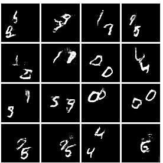

# videoGAN
My smal project to implement GAN to generate video with an LSTM encodes the transformation of video frames in noise space.

## Datasets:

- [X] [Moving MNISTS](http://www.cs.toronto.edu/~nitish/unsupervised_video/)
    * [X] Download script
    * [X] Loading script
- [ ] [Ms Pacman](https://drive.google.com/file/d/0Byf787GZQ7KvV25xMWpWbV9LdUU/view)
    * [ ] Download script
    * [ ] Loading script

## Tasks:

- [X] Generator
    * [X] Cleanup
    * [X] Tested
    * Recurrent part in the generator is hard to pick up gradient
    * Use Adam
- [X] Discriminator
    * [X] Cleaned up
    * [X] Tested
    * Too strong compared to generator
    * [X] Use normal SGD. Not that better compared to Adam
- [X] Add training ops
    * [X] gradient clipping. Clip by GLOBAL norm will make gradient of recurrent unit goes to 0 as gradient of video
    output part increase. Use clip by individual norm instead
    * Add supervised pretrain?
    * [X] Added addtional white gaussian noises to input of the generator. Will this help making the generator weaker?
     (http://www.inference.vc/instance-noise-a-trick-for-stabilising-gan-training/)
    * Currently it seems there is not enough gradient information passed to the recurrent module of the generator
    * [X] Try training each network until under a threshold: Implemented
- [X] Add Glorot Intialization
- [X] Training Pipeline
    * [X] Add command line
    * [X] Add Save/Load
- [X] Add visualization
    * [X] Tensorboard Visualization
    * [X] GIFs
- [ ] Parameters Search
- [ ] Evaluation

## Network structure:

The generator consist of two parts:
- An LSTM that transform the noise from the current frame to the next frame
- A DCGAN generator to generate the frame from the noise.
- Layer Normalization is used in place of Batch Normalization

The discriminator is the from the paper
 "Generating Videos With Scence Dynamics" (http://web.mit.edu/vondrick/tinyvideo/paper.pdf).
 No Bach Normalization in the discriminator.

## GAN training:

Train is done by using Wasserstein GAN with Gradient Policy, lambda = 200.0.
Basic Loss and Alternative Loss for GAN training is also available.

Adam Optimizer is used for the discrimnator and the DCGAN part of the generator.

Stochastic Gradient Descent with momentum is used for the LSTM part of the generator.

## Things I learned from training using Wasserstein-GAN with Gradient Policy (WGAN-GP):
### About the three losses I tried:
- Basic version of GAN loss doesn't work for this model. The LSTM part of the generator didn't receive much gradients to
learn from
- Alternative -log(D(G(noise))) version of GAN loss is able to provide big and unstable gradient to LSTM part and learn quickly
at first but unable to go further than learning some of the moving dynamics and some vague digit shapes. After that,
it diverge and video quality looks worse overtime. Also, extreme mode collapse.
- WGAN-GP learn quicker than alternative loss, gradients are stable. At first the discriminator loss go down but after a few thousand iterations,
it goes up steadily. Video quality goes up as discriminator loss goes up. Generator loss doesn't mean that much. No witnessed mode collapse
### Some note about training WGAN-GP:
- If not use gradient clipping, the gradients of some parameters can go upto 25-30. Those big values doesn't seem to have
any effects though.
- Using layer normalization in the discriminator seem to make it harder for the discriminator to learn
 (shown as gradients of the generator go down to 0 for some iteration) and make it worse for everything. (this is confirmed
 after 2nd try).
- The discriminator should be trained more than the generator to reach optimum. From the github of Wasserstein-GAN
 original, the first few iteration we should train the discriminator 100 iters instead of 5 iters for 1 generator iter.
- For LSTM one should not use Adam, instead use SGD+momentum (0.001, 0.95 seems to work well)
